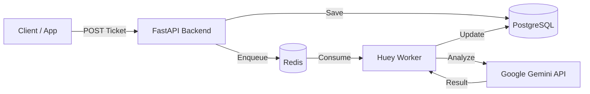

# 🏥 Triage & Recovery Hub - Backend

<div align="center">

[](./README.vi.md)

[](https://www.python.org/)
[](https://fastapi.tiangolo.com/)
[](https://www.postgresql.org/)
[](https://redis.io/)
[](https://www.docker.com/)
[](https://aistudio.google.com/)


**Automated Customer Support & Triage System powered by AI**
_Understand instantly - Respond immediately - Zero cost_

[Demo Video](#) | [API Docs](http://localhost:8000/docs) | [Report Bug](#)

</div>

---

## 🌟 Introduction

**Triage & Recovery Hub** is a powerful backend solution automating the customer support workflow. It ingests complaints, utilizes **Google Gemini AI** to analyze sentiment, assess urgency, and automatically draft professional responses, saving up to 80% of support handling time.

### ✨ Key Features

| Feature                   | Description                                                     | Tech                      |
| :------------------------ | :-------------------------------------------------------------- | :------------------------ |
| 🧠 **AI Triage**          | Categorize complaints (Billing, Tech, Feature) & assess urgency | `Google Gemini`           |
| ❤️ **Sentiment Analysis** | Score customer sentiment (1-10) for prioritization              | `Gemini Pro`              |
| ✍️ **Auto-Draft**         | Automatically generate professional drafts                      | `Generative AI`           |
| ⚡ **Real-time Queue**    | Asynchronous processing, non-blocking requests                  | `Huey` + `Redis`          |
| 🛡️ **Secure Design**      | Sensitive data masking, anti-collision, transaction rollbacks   | `Pydantic` + `SQLAlchemy` |

---

## 🏗️ Architecture



---

## 🚀 Quick Start

### 1️⃣ Prerequisites

- **Docker Design** & **Docker Compose**
- **Google API Key** (Free): [Get it here](https://aistudio.google.com/)

### 2️⃣ Setup

```bash
# Clone project
git clone https://github.com/your-repo/triage-recovery-hub-be.git
cd triage-recovery-hub-be

# Configure environment
cp .env.example .env
# ⚠️ Open .env file and add your GOOGLE_API_KEY!
```

### 3️⃣ Deploy

Use Docker Compose to launch the full stack (db, redis, backend, worker):

```bash
docker-compose up -d --build
```

> **Note:** The system will automatically create database tables on startup. No manual migration needed.

### 4️⃣ Verify

- **Health Check**: [http://localhost:8000/health](http://localhost:8000/health)
- **API Docs**: [http://localhost:8000/docs](http://localhost:8000/docs)

---

## 📚 API Usage Guide

### 1. Create Ticket (Customer)

Send a complaint request. AI will process it in 3-5 seconds.

```bash
curl -X POST http://localhost:8000/api/tickets \
  -H "Content-Type: application/json" \
  -d '{"customer_complaint": "I was charged twice for order #123! Refund me NOW!"}'
```

### 2. View Result (Agent)

Retrieve ticket details to see AI analysis.

```bash
curl http://localhost:8000/api/tickets/1
```

**Example Response:**

```json
{
  "status": "completed",
  "category": "Billing",
  "urgency": "High",
  "sentiment_score": 2,
  "ai_draft_response": "Hello, I sincerely apologize for the double charge..."
}
```

---

## 🛠️ Tech Stack Details

| Component        | Tech                                                                                          | Version       |
| :--------------- | :-------------------------------------------------------------------------------------------- | :------------ |
| **Language**     |              | `3.11`        |
| **Framework**    |           | `0.109+`      |
| **Database**     |  | `16`          |
| **Worker**       |                                    | `2.4.5`       |
| **Cache/Queue**  |                 | `7.0`         |
| **LLM Provider** |       | `Pro / Flash` |

---

## 🛡️ Security & Performance

- **Non-root Container**: Runs as `appuser` for security.
- **Fail-safe Transactions**: Automatic `rollback` on DB errors.
- **Timeout Protection**: AI API calls strictly timed out (30s).
- **Input Validation**: XSS prevention and strict Pydantic v2 validation.

---

## 🤝 Contributing

1. Fork the project
2. Create your feature branch (`git checkout -b feature/AmazingFeature`)
3. Commit your changes (`git commit -m 'Add some AmazingFeature'`)
4. Push to the branch (`git push origin feature/AmazingFeature`)
5. Open a Pull Request

---

<div align="center">
  <p>Made with ❤️ by <b>Antigravity Team</b></p>
</div>
