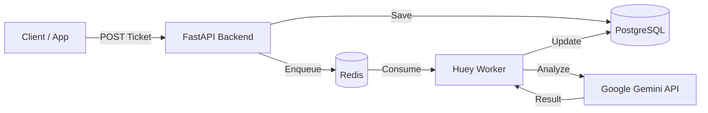

# 🏥 Triage & Recovery Hub - Backend

<div align="center">

[](./README.md)

[](https://www.python.org/)
[](https://fastapi.tiangolo.com/)
[](https://www.postgresql.org/)
[](https://redis.io/)
[](https://www.docker.com/)
[](https://aistudio.google.com/)


**Hệ thống phân loại và xử lý khiếu nại khách hàng tự động bằng AI**
_Nhanh chóng thấu hiểu - Phản hồi tức thì - Chi phí bằng 0_

[Demo Video](#) | [API Docs](http://localhost:8000/docs) | [Report Bug](#)

</div>

---

## 🌟 Giới thiệu

**Triage & Recovery Hub** là giải pháp backend mạnh mẽ giúp tự động hóa quy trình chăm sóc khách hàng. Hệ thống tiếp nhận khiếu nại, sử dụng **Google Gemini AI** để phân tích cảm xúc, mức độ khẩn cấp và tự động soạn thảo câu trả lời, giúp nhân viên CSKH tiết kiệm 80% thời gian xử lý.

### ✨ Tính năng nổi bật

| Tính năng                 | Mô tả                                                               | Công nghệ                 |
| :------------------------ | :------------------------------------------------------------------ | :------------------------ |
| 🧠 **AI Triage**          | Phân loại khiếu nại (Billing, Tech, Feature) & đánh giá độ khẩn cấp | `Google Gemini`           |
| ❤️ **Sentiment Analysis** | Chấm điểm cảm xúc khách hàng (1-10) để ưu tiên xử lý                | `Gemini Pro`              |
| ✍️ **Auto-Draft**         | Tự động viết câu trả lời mẫu chuyên nghiệp                          | `Generative AI`           |
| ⚡ **Real-time Queue**    | Xử lý bất đồng bộ, không chặn request của khách                     | `Huey` + `Redis`          |
| 🛡️ **Secure Design**      | Masking dữ liệu nhạy cảm, anti-collision, rollback an toàn          | `Pydantic` + `SQLAlchemy` |

---

## 🏗️ Kiến trúc hệ thống



---

## 🚀 Cài đặt & Chạy ngay (Quick Start)

### 1️⃣ Yêu cầu (Prerequisites)

- **Docker Design** & **Docker Compose**
- **Google API Key** (Miễn phí): [Lấy tại đây](https://aistudio.google.com/)

### 2️⃣ Thiết lập (Setup)

```bash
# Clone project
git clone https://github.com/your-repo/triage-recovery-hub-be.git
cd triage-recovery-hub-be

# Cấu hình môi trường
cp .env.example .env
# ⚠️ Mở file .env và điền GOOGLE_API_KEY của bạn vào!
```

### 3️⃣ Khởi chạy (Deploy)

Sử dụng Docker Compose để dựng toàn bộ hệ thống (db, redis, backend, worker):

```bash
docker-compose up -d --build
```

> **Note:** Hệ thống sẽ tự động tạo bảng (Tables) khi khởi động. Không cần chạy migration thủ công.

### 4️⃣ Kiểm tra (Verify)

- **Health Check**: [http://localhost:8000/health](http://localhost:8000/health)
- **API Docs**: [http://localhost:8000/docs](http://localhost:8000/docs)

---

## 📚 Hướng dẫn sử dụng API

### 1. Tạo Ticket (Customer)

Gửi request tạo khiếu nại. AI sẽ tự động xử lý sau 3-5 giây.

```bash
curl -X POST http://localhost:8000/api/tickets \
  -H "Content-Type: application/json" \
  -d '{"customer_complaint": "Tôi bị trừ tiền 2 lần cho đơn hàng #123! Hoàn tiền ngay!"}'
```

### 2. Xem kết quả xử lý (Agent)

Lấy thông tin ticket để xem kết quả phân tích từ AI.

```bash
curl http://localhost:8000/api/tickets/1
```

**Kết quả mẫu:**

```json
{
  "status": "completed",
  "category": "Billing",
  "urgency": "High",
  "sentiment_score": 2,
  "ai_draft_response": "Chào bạn, xin lỗi vì sự cố trừ tiền đúp..."
}
```

---

## 🛠️ Tech Stack Chi tiết

| Component        | Tech                                                                                          | Phiên bản     |
| :--------------- | :-------------------------------------------------------------------------------------------- | :------------ |
| **Language**     |              | `3.11`        |
| **Framework**    |           | `0.109+`      |
| **Database**     |  | `16`          |
| **Worker**       |                                    | `2.4.5`       |
| **Cache/Queue**  |                 | `7.0`         |
| **LLM Provider** |       | `Pro / Flash` |

---

## 🛡️ Security & Performance

- **Non-root Container**: Chạy dưới quyền `appuser` để bảo mật.
- **Fail-safe Transactions**: Cơ chế `rollback` tự động khi lỗi DB.
- **Timeout Protection**: Giới hạn thời gian gọi AI API (30s).
- **Input Validation**: Chặn XSS và validate dữ liệu chặt chẽ với Pydantic v2.

---

## 🤝 Contributing

1. Fork dự án
2. Tạo branch feature (`git checkout -b feature/AmazingFeature`)
3. Commit (`git commit -m 'Add some AmazingFeature'`)
4. Push (`git push origin feature/AmazingFeature`)
5. Mở Pull Request

---

<div align="center">
  <p>Made with ❤️ by <a href="https://github.com/MangBao"><b>MangBao</b></a></p>
</div>
